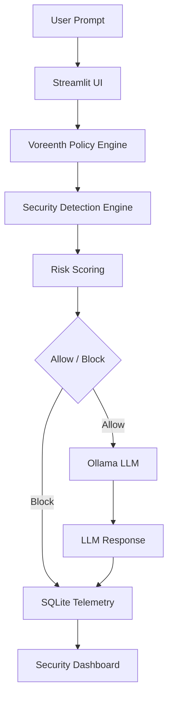

# Voreenth

[](https://www.linkedin.com/in/jibril-anifowoshe)
[](https://voreenth.streamlit.app)
[](https://www.python.org/)
[](LICENSE)
[](https://youtu.be/kFEC75G0gJ8)
[](https://jibrilctrl.com)
[](https://www.linkedin.com/in/jibril-anifowoshe)

### AI Runtime Security Gateway for Large Language Models

Created by **Jibril Anifowoshe**

Voreenth is an open-source AI Runtime Security Gateway that inspects prompts before they reach a Large Language Model (LLM). Rather than relying on the model itself to determine whether a request is safe, Voreenth evaluates prompts against security policies, assigns a risk score, and enforces allow/block decisions before inference occurs.

This project demonstrates a practical enterprise security pattern that can be applied to local and cloud-hosted AI systems.

---

## Links

🚀 **Live Application**
https://voreenth.streamlit.app

🎥 **YouTube Walkthrough**  
https://youtu.be/kFEC75G0gJ8

🌐 **Website**  
https://jibrilctrl.com

💼 **LinkedIn**  
https://www.linkedin.com/in/jibril-anifowoshe

---

## Features

- Runtime Prompt Inspection
- Prompt Injection Detection
- Environment Reconnaissance Detection
- System Prompt Extraction Detection
- Secret & API Key Detection
- Sensitive Data (DLP-like) Detection
- Risk Scoring & Severity Classification
- Allow / Block Policy Enforcement
- Local SQLite Security Telemetry
- Interactive Streamlit Dashboard
- Local Ollama Integration

---

## Architecture



---

## Detection Capabilities

Voreenth currently detects:

- Prompt Injection
- System Prompt Extraction
- Environment Reconnaissance
- Secret / API Key Exposure
- Sensitive Data (PII)
- Credential Extraction Attempts
- Oversized Prompt Inspection

---

## Technology Stack

- Python
- Streamlit
- SQLite
- Ollama
- Qwen 3

---

## Repository Structure

```text
app.py
policy_engine.py
database.py
ollama_client.py
README.md
LICENSE
requirements.txt
```

---

## Running Locally

```bash
python3 -m venv .venv

source .venv/bin/activate

pip install -r requirements.txt

ollama pull qwen3:1.7b

ollama serve

streamlit run app.py
```

---

## Enterprise Mapping

Although this project runs locally using Ollama, the architecture is model agnostic and can be be positioned in front of:

- Azure OpenAI
- Azure AI Foundry
- Amazon Bedrock
- Google Vertex AI
- Anthropic Claude
- OpenAI Enterprise
- Internal AI Platforms
- Agentic AI Workflows

The same runtime inspection, risk scoring, policy enforcement, and telemetry workflow can operate independently of the underlying language model.

---

## Roadmap

Future enhancements include:

- Policy-as-Code
- RBAC Integration
- Microsoft Entra ID Authentication
- Azure Key Vault Integration
- Microsoft Sentinel Integration
- Adaptive Risk Scoring
- Configurable Detection Policies
- Agent Runtime Protection
- MCP Security Controls
- RAG Inspection

---

## Disclaimer

Voreenth is an educational proof-of-concept intended to demonstrate runtime AI security concepts. It is not intended to replace enterprise security products.

---

Created by **Jibril Anifowoshe**

© 2026 Jibril Anifowoshe • Released under the MIT License.
